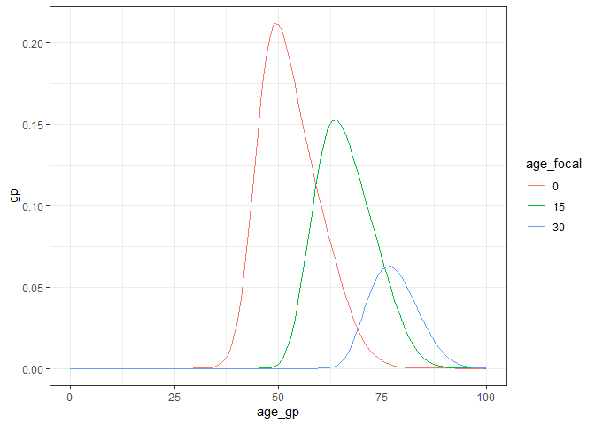
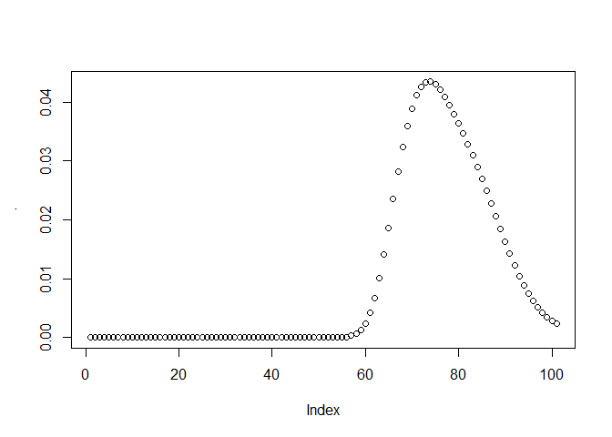
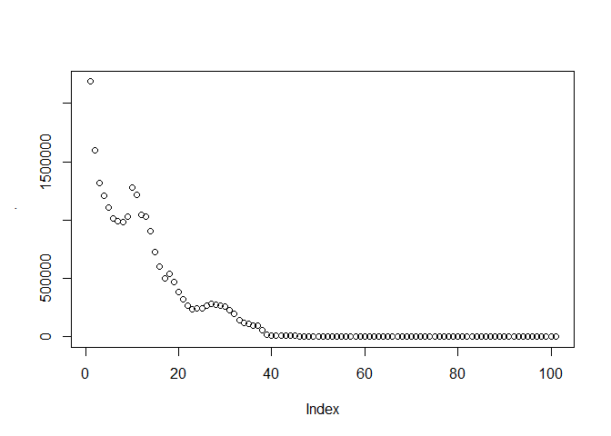

How many grandparents are there in the world?
================
Dec 04 2022

  - [1. Installation](#1-installation)
  - [2. Get data](#2-get-data)
  - [3. Number of grandparentes in a
    population](#3-number-of-grandparentes-in-a-population)
  - [Plots](#plots)
  - [References](#references)

We will use matrix kinship models in a time-variant framework (Caswell
and Song 2021) to compute the expected number of grandparents and
grandchildren in a range of countries and the related kin dependencies.

The code runs in R, preferably in RStudio.


# 1\. Installation

Install the [development version](https://github.com/IvanWilli/DemoKin)
of DemoKin from GitHub (could take \~1 minute). We made changes to the
`DemoKin` package recently. If you had already installed the package,
please uninstall it and and install it again.

``` r
# remove.packages("DemoKin")
# install.packages("devtools")
devtools::install_github("IvanWilli/DemoKin", build_vignettes = TRUE)
```

Load packages:

``` r
library(DemoKin)
library(dplyr)
library(tidyr)
library(purrr)
library(ggplot2)
library(countrycode)
library(knitr)
```

Define a function to get necessary data from the UNWPP

``` r
get_UNWPP_inputs <- function(countries, my_startyr, my_endyr, variant = "Median"){
  
  
  print("Getting API ready...")
  # Get data from UN using API
  
  base_url <- 'https://population.un.org/dataportalapi/api/v1'
  
  # First, identify which indicator codes we want to use
  
  target <- paste0(base_url,'/indicators/?format=csv')
  codes <- read.csv(target, sep='|', skip=1) 
  
  qx_code <- codes$Id[codes$ShortName == "qx1"]
  asfr_code <- codes$Id[codes$ShortName == "ASFR1"]
  pop_code <- codes$Id[codes$ShortName == "PopByAge1AndSex"]
  
  # Get location codes
  
  target <- paste0(base_url, '/locations?sort=id&format=csv')
  df_locations <- read.csv(target, sep='|', skip=1)
  
  # find the codes for countries
  
  my_location <- 
    df_locations %>% 
    filter( Name %in% countries) %>% 
    pull(Id) %>% 
    paste(collapse = ",")
  
  # Get px values
  
  print(paste0("Getting mortality data for ", paste(countries, collapse = ", ")))
  
  my_indicator <- qx_code
  my_location  <- my_location
  
  target <- paste0(base_url,
                   '/data/indicators/',my_indicator,
                   '/locations/',my_location,
                   '/start/',my_startyr,
                   '/end/',my_endyr,
                   '/?format=csv')
  
  px <- 
    read.csv(target, sep='|', skip=1) %>% 
    filter(Variant %in% variant) %>% 
    filter(Sex == "Female") %>% 
    mutate(px = 1- Value) %>% 
    select(Location, Time = TimeLabel, age = AgeStart, px)
  
  # ASFR
  
  print(paste0("Getting fertility data for ", paste(countries, collapse = ", ")))
  
  my_indicator <- asfr_code
  
  target <- paste0(base_url,
                   '/data/indicators/',my_indicator,
                   '/locations/',my_location,
                   '/start/',my_startyr,
                   '/end/',my_endyr,
                   '/?format=csv')
  
  asfr <- 
    read.csv(target, sep='|', skip=1) %>% 
    filter(Variant %in% variant) %>% 
    select(Location, Time = TimeLabel, age = AgeStart, ASFR = Value)
  
  data <- 
    px %>% 
    left_join(asfr, by = c("Location", "Time", "age")) %>% 
    mutate(ASFR = replace(ASFR,is.na(ASFR),0)) 
  
  data
}

# To get UN population
get_unwpp_pop <- function(countries,  my_startyr = 2022, my_endyr = 2022){
  base_url <- 'https://population.un.org/dataportalapi/api/v1'
  
  # First, identify which indicator codes we want to use
  
  target <- paste0(base_url,'/indicators/?format=csv')
  codes <- read.csv(target, sep='|', skip=1) 
  
  pop_code <- codes$Id[codes$ShortName == "PopByAge1AndSex"]
  
  # Get location codes
  
  target <- paste0(base_url, '/locations?sort=id&format=csv')
  df_locations <- read.csv(target, sep='|', skip=1)
  
  # find the codes for countries
  iso3 <- countrycode(countries, origin = "country.name", destination = "iso3c")
  
  locs <- 
    df_locations %>% 
    filter(Iso3 %in% iso3) %>% 
    pull(Id) 
  
  my_location <- paste(locs, collapse = ",")
  
  print(paste0("Getting pop data for ", paste(countries, collapse = ", ")))
  
  
  # Avoid overwhelming UN APi
  if(length(countries) <= 20){
    
    my_indicator <- pop_code
    my_location  <- my_location
    
    target <- paste0(base_url,
                     '/data/indicators/',my_indicator,
                     '/locations/',my_location,
                     '/start/',my_startyr,
                     '/end/',my_endyr,
                     '/?format=csv')
    
    pop <- 
      read.csv(target, sep='|', skip=1) %>% 
      filter(Variant == "Median") %>% 
      select(iso3 = Iso3, country = Location, year = TimeLabel, age = AgeStart, sex = Sex, value = Value)
    
  } else{
    print("Many countries, I'll process in batch")
    
    my_indicator <- pop_code
    
    times <- floor(length(locs)/10)
    sp_vec <- rep(1:10, times)
    extras <- length(locs) - length(sp_vec)
    if(extras > 0) sp_vec <- c(sp_vec, 1:extras)
    
    my_location_l  <- split(locs, sp_vec)
    
    pop <- 
      lapply(1:length(my_location_l), function(n, my_location_l){
        
        print(paste0("Processing batch ", n, "/", length(my_location_l) ))
        
        loc_n <- paste(my_location_l[[n]], collapse = ",")
        
        target <- paste0(base_url,
                         '/data/indicators/',my_indicator,
                         '/locations/', loc_n,
                         '/start/',my_startyr,
                         '/end/',my_endyr,
                         '/?format=csv')
        
        pop <- read.csv(target, sep='|', skip=1)
        
        Sys.sleep(1)
        pop
      }, my_location_l) %>% 
      bind_rows() %>% 
      filter(Variant == "Median") %>% 
      select(iso3 = Iso3, country = Location, year = TimeLabel, age = AgeStart, sex = Sex, value = Value)
    
  }
  
  return(pop) 
  
}
```

# 2\. Get data

Let’s get the numbers of China, Guatemala, and Germany:

``` r
# pick countries
countries <- c("China", "Guatemala", "Germany")
# countries <- c("Guatemala")

output_period <- c(2000, 2020)

# Year range

my_startyr   <- 1950
my_endyr     <- 2022

data <- get_UNWPP_inputs(
  countries = countries
  , my_startyr = my_startyr
  , my_endyr = my_endyr
  )
```

    ## [1] "Getting API ready..."
    ## [1] "Getting mortality data for China, Guatemala, Germany"
    ## [1] "Getting fertility data for China, Guatemala, Germany"

``` r
# Get UN population
# World population in 2022
pop <- 
  # get_unwpp_pop(countries, my_startyr = 2022, my_endyr = 2022) %>% 
    get_unwpp_pop(countries, my_startyr = min(output_period), my_endyr = max(output_period)) %>% 
  filter(sex == "Both sexes") %>%
  select(iso3, year, age, pop_un = value)
```

    ## [1] "Getting pop data for China, Guatemala, Germany"

Run kinship models for 2022 period:

``` r
period_kin_l <- lapply(split(data, list(data$Location)), function(X){
      print(unique(X$Location))
    U <-
      X %>%
      select(Time, age, px) %>%
      pivot_wider(names_from = Time, values_from = px) %>%
      select(-age) %>% 
      as.matrix()
    f <- X %>%
      select(Time, age, ASFR) %>%
      mutate(ASFR = ASFR/1000) %>% 
      pivot_wider(names_from = Time, values_from = ASFR) %>%
      select(-age) %>% 
      as.matrix()
    k <- kin(U, f, time_invariant = FALSE, output_kin = c("gm","gd"), output_period = output_period)
    k$kin_summary$Location <- 
      k$kin_full$Location <- unique(X$Location)
    k
})
```

    ## [1] "China"

    ## Stable assumption was made for calculating pi on each year because no input data.

    ## Warning: replacing previous import 'lifecycle::last_warnings' by
    ## 'rlang::last_warnings' when loading 'hms'

    ## Assuming stable population before 1950.

    ## [1] "Germany"

    ## Stable assumption was made for calculating pi on each year because no input data.

    ## Assuming stable population before 1950.

    ## [1] "Guatemala"

    ## Stable assumption was made for calculating pi on each year because no input data.
    ## Assuming stable population before 1950.

``` r
# period_kin_summary <- 
#   lapply(period_kin_l, `[[`, 'kin_summary') %>% 
#   bind_rows()

period_kin_full <- 
  lapply(period_kin_l, `[[`, 'kin_full') %>% 
  bind_rows()
```

# 3\. Number of grandparentes in a population

The intuition here is that if Focal has 2 maternal grandmothers (since
we are operating in a female matrilineal population). So, if we use GKP
factors, we can approximate the number of grandparents as `g(x) =
gm(x)*4`. (Caswell 2022). In a given population, around 4 people will
share a grandparent. So, an approximation of the number of grandparents
would be a factor of the population `p(x)` by `g(x)/4`.

## Number of granchildren is given by age distribution of grandparents of Focal

``` r
#  From Ivan 20220212
# 
# Permiteme generalizar un poco a ver si nos acercamos m?s a los valores:
#  - Focal tiene 10 a?os
#  - Tiene 0.4 abuelas de 85 a?os y 0.1 abuelas de 90 a?os.
#  - Un Focal de 85 a?os tiene el 20% de sus nietas con 10 a?os.
#  - Un Focal de 90 a?os tiene el 10% de sus nietas con 10 a?os.
#  - Las mujeres de edad 10 son 1.000 en la poblaci?n real.
#  - La cantidad de abuelas (l?nea materna) que corresponden a personas de 10 a?os es: 1000 * (0.4 * 20% + 0.1 * 10%) =  90.

gp <- 
  period_kin_full %>% 
  filter(kin == "gm") %>% 
  select(Location, year, age_focal, age_gp = age_kin, gm = living) %>% 
  # these are just maternal grandmothers. multiply by 4
  mutate(gp = gm)

gd <- 
  period_kin_full %>% 
  filter(kin == "gd") %>% 
  select(Location, year, age_focal, age_gd = age_kin, gd = living) %>% 
  group_by(Location, year, age_focal) %>% 
  mutate(
    share_gd = gd / sum(gd)
    , share_gd = ifelse(is.nan(share_gd), 0, share_gd)
    ) %>% 
  ungroup()

# What % of a grandparent's aged 90 are 60yo?

gd %>% 
  filter(Location == "China", year == 2000, age_focal == 90) %>% 
  pull(share_gd) %>% 
  plot
```

<!-- -->

``` r
gpd <- 
  left_join(
    gp, gd
    , by = c("Location", "year", "age_gp" = "age_focal", "age_focal" = "age_gd")
    ) %>% 
  mutate(iso3 = countrycode(Location, origin = "country.name", destination = "iso3c")) %>% 
  select(-Location)

# What % of a 20yo Focal's grandparents are x y old?

gpd %>% 
  filter(iso3 == "CHN", year == 2000, age_focal == 20) %>% 
  pull(share_gd) %>% 
  plot
```

<!-- -->

``` r
# Get total number of grandparentes

gp_num_age <- 
  gpd %>% 
  group_by(iso3, year, age_focal) %>% 
  summarise(gp_sum = sum(gp*share_gd)) %>% 
  ungroup() %>% 
  # gp_sum is the expected number of 'unique' grandparents for a Focal aged x
  # accounting for the fact some grandparents are shared by multiple grandchildren
  left_join(
    pop %>% select(iso3, year, age, pop_un)
    , by = c("iso3", "year", "age_focal" = "age")
  ) %>%
  mutate(gp_num = pop_un * gp_sum)
```

    ## `summarise()` has grouped output by 'iso3', 'year'. You can override using the
    ## `.groups` argument.

``` r
# 
gp_num_age %>% 
  filter(iso3 == "CHN", year == 2000) %>% 
  pull(gp_num) %>% 
  plot()
```

<!-- -->

``` r
gp_num <- 
  gp_num_age %>% 
  group_by(iso3, year) %>% 
  summarise(gp_tot = sum(gp_num)) %>% 
  ungroup()
```

    ## `summarise()` has grouped output by 'iso3'. You can override using the `.groups`
    ## argument.

``` r
# Plot

gp_num %>% 
  mutate(gp_tot = gp_tot/1e6 * 4)
```

    ## # A tibble: 6 x 3
    ##   iso3   year gp_tot
    ##   <chr> <int>  <dbl>
    ## 1 CHN    2000  95.9 
    ## 2 CHN    2020 101.  
    ## 3 DEU    2000   4.76
    ## 4 DEU    2020   4.56
    ## 5 GTM    2000   1.25
    ## 6 GTM    2020   1.61

# Plots

# References

<div id="refs" class="references">

<div id="ref-caswell_formal_2022">

Caswell, Hal. 2022. “The Formal Demography of Kinship IV: Two-Sex Models
and Their Approximations.” *Demographic Research* 47 (September):
359–96. <https://doi.org/10.4054/DemRes.2022.47.13>.

</div>

<div id="ref-caswell_formal_2021">

Caswell, Hal, and Xi Song. 2021. “The Formal Demography of Kinship. III.
Kinship Dynamics with Time-Varying Demographic Rates.” *Demographic
Research* 45: 517–46.

</div>

</div>
